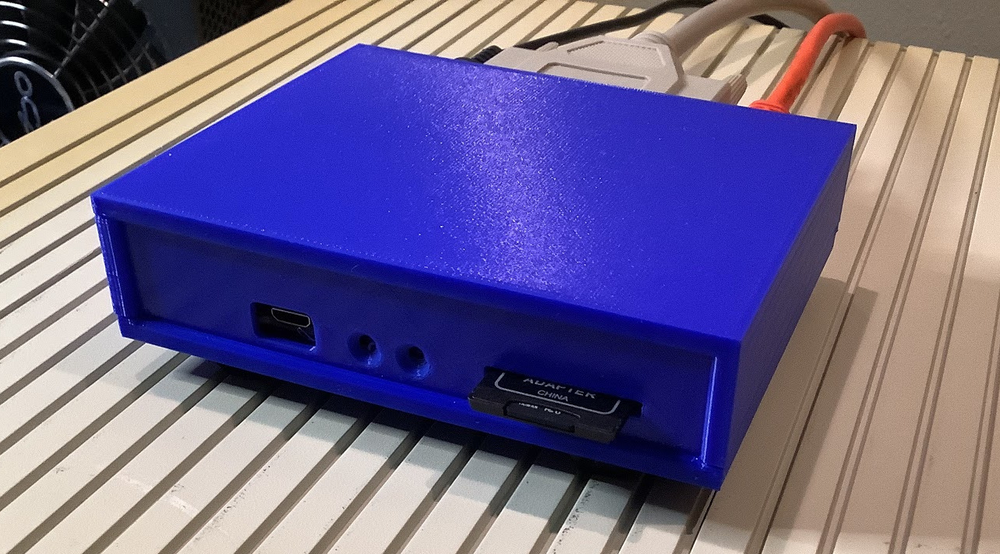

scuznet case
============

This is an awesome 3D printable case for a V2 scuznet, designed by Chopsticks
on 68KMLA and provided graciously to the project. The original post where this
was discussed was lost in the forum crash, but for some details, check out the
thread
[here](https://68kmla.org/bb/index.php?threads/scsi-to-ethernet-adapter-on-new-hardware.34586/page-14#post-444259)
and related context.

