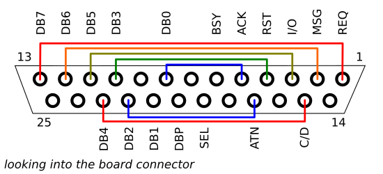

Board Testing
=============

This is a special routine that can be flashed to a scuznet board, to help
diagnose problems with shorted pins and the like.

**Very important note**: before flashing this firmware, ensure the board is
disconnected from the bus!

This implementation is under development and has not been extensively tested.
Suggestions are welcome.

Test Rig
--------

Several control lines on the board do not have associated drivers to keep the
part count down. To test everything, the following connections from the control
lines to the data lines are needed. This could be done with jumper wires, or
a specially-constructed DB25 male jack to allow easy re-use.

Error Reports
-------------

If all tests pass, the board will pulse the status LED.

In all other cases, the LED will flash a number of long pulses, then a number
of short pulses, then an optional set of long pulses. Look up the respective
pulses in the list below to see what the error means.

* 1-x-0: TDB(x-1) is registering '1' when not being driven (external pull-down 
  not working).
* 2-x-y: TDB(x-1) is causing TDB(y-1) to change unexpectedly.
* 3-x-y: TDB(x-1) is causing RDB(y-1) to change unexpectedly.
* 4-x-1: control line is registering assertion when not asserted.
* 4-x-2: control line is not registering assertion when asserted.
* 5-x-y: control line 'x' is causing control line 'y' to change unexpectedly.

The control line flash codes are as follows:

* ACK: 1
* SEL: 2
* ATN: 3
* RST: 4
* C/D: 5
* I/O: 6
* MSG: 7
* REQ: 8
* BSY: 9
* DBP: 10

License
-------

Except where otherwise noted, all files in this repository are available under
the terms of the GNU General Public License, version 3, available in the
LICENSE document. There is NO WARRANTY, not even for MERCHANTABILITY or
FITNESS FOR A PARTICULAR PURPOSE. For details, refer to the license.
